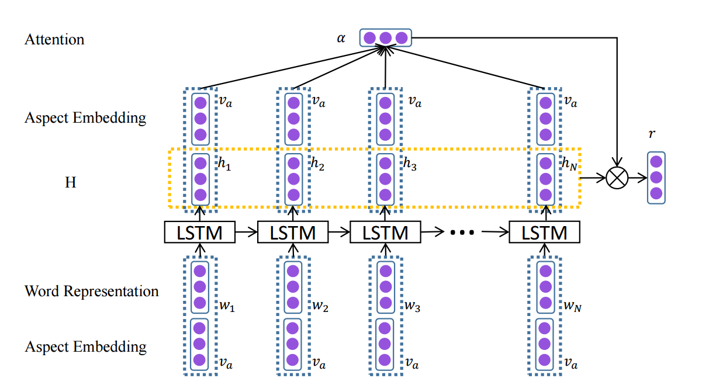
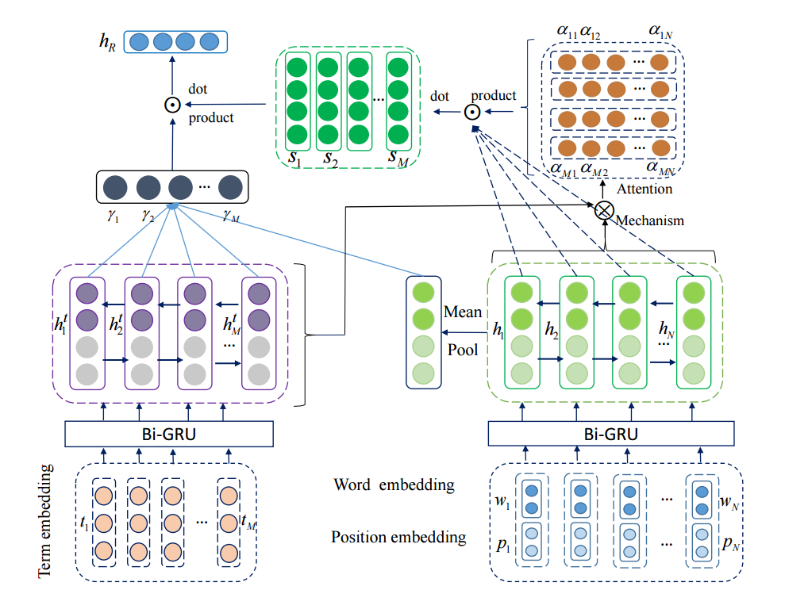

# PBAN-PyTorch

> [PyTorch](https://pytorch.org/) implementation of [Gu et al.'s COLING 2018](https://aclweb.org/anthology/C18-1066) work.

[](LICENSE)

## Requirement

* PyTorch >= 0.4.0
* NumPy >= 1.13.3
* Python 3.6
* GloVe pre-trained word vectors:
  * Download pre-trained word vectors [here](https://github.com/stanfordnlp/GloVe#download-pre-trained-word-vectors).
  * Extract the [glove.twitter.27B.zip](http://nlp.stanford.edu/data/wordvecs/glove.twitter.27B.zip) and [glove.42B.300d.zip](http://nlp.stanford.edu/data/wordvecs/glove.42B.300d.zip) to the `\glove\` folder.

## Dataset

Based on the restaurant and laptop dataset of [SemEval-2014 Task 4](http://alt.qcri.org/semeval2014/task4/).

### Restaurant Dataset

| Polarity | #Positive | #Negative | #Neutral |
| -------- | --------- | --------- | -------- |
| Train    | 2164      | 807       | 637      |
| Test     | 728       | 196       | 196      |

### Laptop Dataset

| Polarity | #Positive | #Negative | #Neutral |
| -------- | --------- | --------- | -------- |
| Train    | 994       | 870       | 464      |
| Test     | 341       | 128       | 169      |

## Usage

Train the model:

```sh
python train.py --model_name pban --dataset restaurant
```

Show help message and exit:

```sh
python train.py -h
```

## Implemented models

### LSTM

Tang, Duyu, et al. "Effective LSTMs for Target-Dependent Sentiment Classification." Proceedings of COLING 2016, the 26th International Conference on Computational Linguistics: Technical Papers. 2016. [[pdf]](https://arxiv.org/pdf/1512.01100)


### ATAE-LSTM

Wang, Yequan, Minlie Huang, and Li Zhao. "Attention-based LSTM for aspect-level sentiment classification." Proceedings of the 2016 conference on empirical methods in natural language processing. 2016. [[pdf]](http://www.aclweb.org/anthology/D16-1058)



### PBAN

Gu, Shuqin, et al. "A Position-aware Bidirectional Attention Network for Aspect-level Sentiment Analysis." Proceedings of the 27th International Conference on Computational Linguistics. 2018. [[pdf]](http://www.aclweb.org/anthology/C18-1066)



## Performance

### Restaurant Dataset

#### Three-class

| Model     | In Paper  | This Code |
| --------- | --------- | --------- |
| LSTM      | 74.28     | 77.68     |
| ATAE-LSTM | 77.20     | 78.30     |
| PBAN      | **81.16** | **80.89** |

#### Two-class

| Model     | In Paper  | This Code |
| --------- | --------- | --------- |
| LSTM      | -         | -         |
| ATAE-LSTM | 90.90     | 90.26     |
| PBAN      | **91.67** | **92.32** |

### Laptop Dataset

#### Three-class

| Model     | In Paper  | This Code |
| --------- | --------- | --------- |
| LSTM      | 66.45     | 71.00     |
| ATAE-LSTM | 68.70     | 71.32     |
| PBAN      | **74.12** | **74.76** |

#### Two-class

| Model     | In Paper  | This Code |
| --------- | --------- | --------- |
| LSTM      | -         | -         |
| ATAE-LSTM | 87.60     | **87.63** |
| PBAN      | **87.81** | 87.42     |

## Acknowledgements

* Some of the code is borrowed from [songyouwei](https://github.com/songyouwei/ABSA-PyTorch).
* Using this code means you have read and accepted the copyrights set by the dataset providers.

## License

MIT